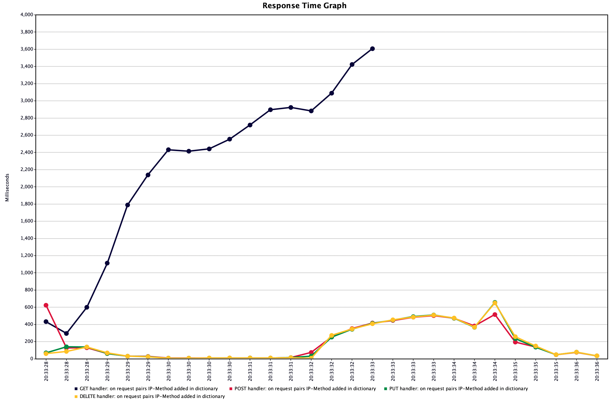
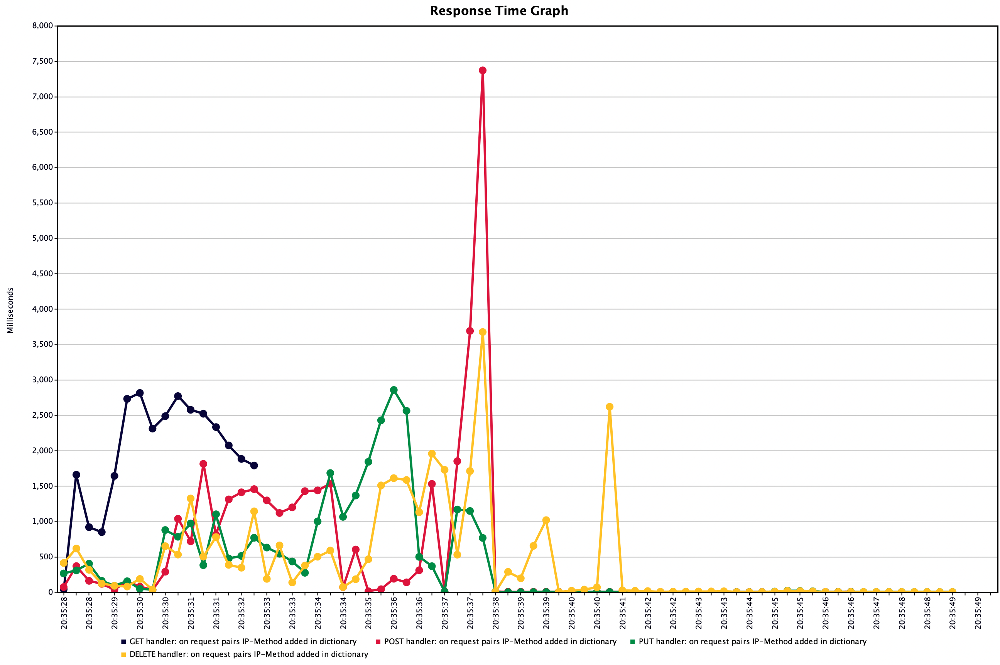
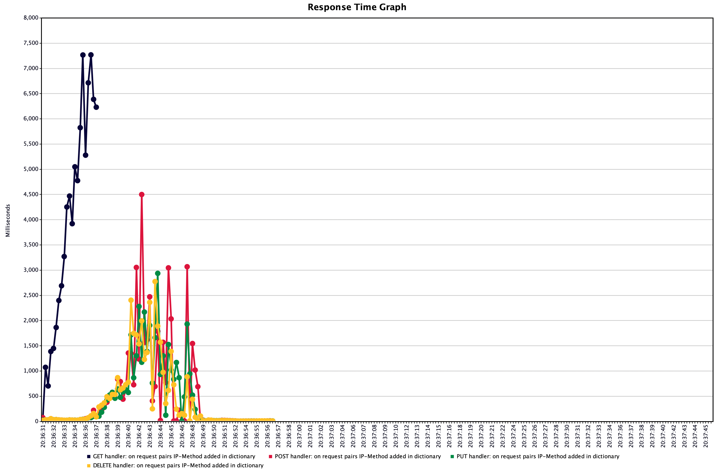

## Домашний проект для тестирования REST-сервисов
В рамках проект осуществляется нагрузочное тестирование 4-х эндпоинтов:
- https://localhost/delete
- https://localhost/put
- https://localhost/post
- https://localhost/get

Документация по API: [смотреть список доступных endpoints](https://localhost/swaggerui)

### Методика нагрузки
В качестве основной единицы нагрузки выбрана пользовательская сессия. В рамках испытаний производилось ступенчатое увеличение пользовательских сессий с последующей фиксацией тренда на снижение отклика по операциям.

### Программные средства
В качестве инструмента нагрузки использовался Apache JMeter v.5.5

Plugins: 
- Summary Report
- Response Time Graph

> Предусловие:
> Среднее время отклика по операциям не должно превышать более 1.5 секунд.

Нагрузочное тестирование проведено в три этапа:
- Волна №1
    - Число пользовательских сессий: 1000
    - Время на прогрев волны: 5

- Волна №2
    - Число пользовательских сессий: 1500
    - Время на прогрев волны: 5

- Волна №3 (Тест максимум)
    - Число пользовательских сессий: 2000
    - Время на прогрев волны: 5

Результаты исследований показали:
- Волна №1
    - /put в пределах допуска 
    - /post в пределах допуска 
    - /delete в пределах допуска 
    - /get за перделами допуска (Avg 2.1 сек)

- Волна №2
    - /put в пределах допуска 
    - /post в пределах допуска 
    - /delete в пределах допуска 
    - /get за перделами допуска (Avg 2.1 сек)

> Примечание:
> Несмотря на то, что среднее время отклика по операциям не превышает допуск, большая часть операций завершилось с ошибкой.

- Волна №3
    - /put в пределах допуска 
    - /post в пределах допуска 
    - /delete в пределах допуска 
    - /get за перделами допуска (Avg 3.8 сек)

> Примечание:
> Несмотря на то, что среднее время отклика по операциям не превышает допуск, большая часть операций завершилось с ошибкой.

## Вывод

По результатам нагрузочного тестирования былf пройдена только первая ступень нагрузки. При это операция get вышла за рамки допуска (1.5 секунды). Ступень 2 и ступень 3 (тест максимум), были пройдены с ошибками. При нагрузке в 1500+ одновременных пользовательских сессий начинаются проблемы с производительностью на уровне backend-сервиса.

### Рекомендации

1. Требуется провести оптимизацию производительности по методу get.
2. Масштабировать/оптимизировать приложение, расширив число одновременных пользовательских сессий (1500+)